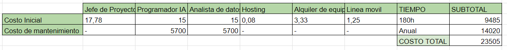
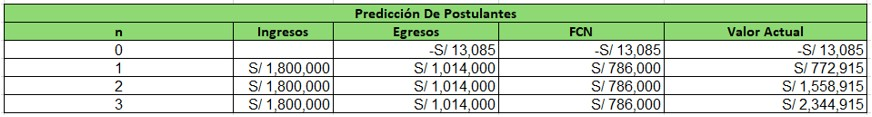

[comment]: 

**UNIVERSIDAD PRIVADA DE TACNA**

**FACULTAD DE INGENIERIA**

**Escuela Profesional de Ingeniería de Sistemas**

**Proyecto: *Predicción De Postulantes Para La Universidad Nacional   De Educación Enrique Guzmán Y Valle***

Curso: *Inteligencia De Negocios*

Docente: *Ing. Cuadros Quiroga, Patrick Jose*

Integrantes:

Melendez Huarachi, Gabriel Fari			(2021070311) 
Lopez Catunta, Brayar Christian         (2020068946) 
Briceño Diaz, Jorge Luis               (2017059611) 
Cuadros Garcia, Mirian				(2021071083) 
Hurtado Ortiz, Leandro				(2015052384) 

**Tacna – Perú**

***2024***

**  
**

\pagebreak

Sistema *{Nombre del Sistema}*

Informe de Factibilidad

Versión *{1.0}*

|CONTROL DE VERSIONES||||||
| :-: | :- | :- | :- | :- | :- |
|Versión|Hecha por|Revisada por|Aprobada por|Fecha|Motivo|
|1\.0|MCG|BLC|LHO|31/08/2024|Versión Original|

\pagebreak

# **INDICE GENERAL**

[1. Descripción del Proyecto](#_Toc52661346)

[2. Riesgos](#_Toc52661347)

[3. Análisis de la Situación actual](#_Toc52661348)

[4. Estudio de Factibilidad](#_Toc52661349)

[4.1 Factibilidad Técnica](#_Toc52661350)

[4.2 Factibilidad económica](#_Toc52661351)

[4.3 Factibilidad Operativa](#_Toc52661352)

[4.4 Factibilidad Legal](#_Toc52661353)

[4.5 Factibilidad Social](#_Toc52661354)

[4.6 Factibilidad Ambiental](#_Toc52661355)

[5. Análisis Financiero](#_Toc52661356)

[6. Conclusiones](#_Toc52661357)

\pagebreak

**<u>Informe de Factibilidad</u>**

1. **Descripción del Proyecto**

    1.1. Nombre del proyecto  
    
   Sistema de Predicción De Postulantes para la Universidad Nacional De Educación Enrique Guzmán Y Valle

    1.2. Duración del proyecto 
    
   Un tiempo de 30 dias
   
    1.3. Descripción

    

    El "Sistema de Predicción de Postulantes para la Universidad Nacional de Educación Enrique Guzmán y Valle" es una solución tecnológica que busca mejorar el proceso de admisión de la universidad. Este sistema, desarrollado en un período de 30 días, emplea técnicas avanzadas de análisis de datos y aprendizaje automático para predecir el desempeño y las probabilidades de éxito de los postulantes en función de diversas variables, como el rendimiento académico previo, resultados de pruebas y datos demográficos.
    

    
    

    El objetivo es proporcionar a la universidad una herramienta que facilite la toma de decisiones informadas en el proceso de selección, optimizando el perfil de los estudiantes admitidos y aumentando las tasas de éxito académico. Además, el sistema será diseñado para integrarse de manera eficiente con las plataformas existentes de la universidad, asegurando una implementación sin contratiempos y un uso intuitivo por parte de los administradores y evaluadores.
    

    1.4. Objetivos

        1.4.1 Objetivo general
   
               Desarrollar un sistema de predicción de postulantes para la Universidad Nacional de Educación Enrique Guzmán y Valle
               que permita identificar y seleccionar a los candidatos con mayores probabilidades de éxito académico, optimizando el
               proceso de admisión y mejorando la calidad de los estudiantes admitidos.

        1.4.2 Objetivos Específicos
   
               ● Implementar un modelo de aprendizaje automático que analice datos históricos de postulantes y determine patrones asociados
                 con el éxito académico.
               ● Desarrollar una interfaz intuitiva para los administradores de la universidad que permita la consulta y visualización de
                 predicciones y datos relevantes de los postulantes.
               ● Integrar el sistema de predicción con las plataformas existentes de la universidad, asegurando una transición fluida y una
                 operatividad eficiente.
               ● Evaluar y ajustar continuamente el modelo predictivo para mejorar su precisión y adaptabilidad a nuevos datos y tendencias
                 de admisión.
               ● Capacitar al personal encargado en el uso y mantenimiento del sistema, garantizando su correcta implementación y uso a largo
                 plazo.

\pagebreak

2. **Riesgos**

    

    - **Errores en los datos**: La calidad de la información y de los datos históricos utilizados determina en gran medida la precisión de las predicciones. Si los datos son incompletos o inexactos, las predicciones pueden ser erróneas o poco confiables.

    - **Cambios en el entorno académico y factores externos**: Los cambios en la legislación educativa, las políticas de admisión o las circunstancias económicas pueden afectar el número de solicitantes. Estos factores son difíciles de predecir y tienen el potencial de cambiar drásticamente las tendencias observadas en años anteriores.

    - **Resistencia a la Alteración y aceptación de resultados**: El personal académico y administrativo puede oponerse a la implementación de un sistema de predicción. Puede haber errores si no confía en los resultados, lo que podría llevar a una falta de aceptación y aplicación del sistema.

    - **Variabilidad en la conducta de los postulantes y cambios en sus preferencias**: Las preferencias de los candidatos pueden cambiar con el tiempo debido a las tendencias sociales, las nuevas carreras o los programas que ofrecen otras instituciones. Esto puede hacer que las predicciones basadas en datos históricos sean menos pertinentes.

    - **Delimitaciones estratégicas y habilidades analíticas**: La efectividad de los modelos predictivos puede verse afectada por la falta de herramientas adecuadas o de personal capacitado para realizar análisis complejos. Esto puede llevar a una sobreestimación o una subestimación del número de candidatos.

    - **Efecto de la competencia**: La cantidad de postulantes puede verse afectada por la aparición de nuevas universidades o programas académicos en otras instituciones. La competencia es un factor clave que no siempre se puede predecir.

    

\pagebreak

3. **Análisis de la Situación actual**

    3.1. Planteamiento del problema

           En la Universidad Nacional de Educación Enrique Guzmán y Valle, el proceso de admisión de postulantes ha sido un desafío
           creciente debido al incremento en el número de aspirantes y la diversidad de sus perfiles académicos. Actualmente, la
           selección de estudiantes se basa en criterios estandarizados que no siempre reflejan el potencial real de los postulantes
           para sobresalir en su educación superior. Esto ha generado una necesidad urgente de mejorar la precisión y eficacia en la
           identificación de candidatos que tienen mayores probabilidades de éxito académico, con el fin de optimizar los recursos
           educativos y aumentar la tasa de retención estudiantil.

           Además, el proceso manual de evaluación de postulantes es tiempo-consuming y susceptible a errores humanos, lo que puede
           llevar a decisiones de admisión subóptimas. La falta de herramientas tecnológicas avanzadas que analicen de manera integral
           y precisa los datos de los aspirantes ha limitado la capacidad de la universidad para mejorar su proceso de selección. Este
           proyecto surge como respuesta a la necesidad de implementar un sistema que utilice técnicas de análisis de datos y predicción
           para optimizar la selección de postulantes, garantizando así que los estudiantes admitidos tengan un perfil adecuado para
           enfrentar los desafíos académicos de la universidad.

    3.2. Consideraciones de hardware y software

        Hardware: Se utilizarán los servidores con los que se cuentan, Las estaciones de trabajo contarán con al menos 8 GB de RAM y procesadores de 4 núcleos. 
        Software: Se implementará Ubuntu Server como sistema operativo, con bases de datos MySQL o PostgreSQL. El sistema será desarrollado en Python utilizando
        librerías de machine learning como Scikit-learn o TensorFlow. La interfaz web se construirá con Django o Flask, junto con tecnologías HTML, CSS, y JavaScript. 
        Seguridad: Se implementará encriptación y autenticación para proteger los datos de los postulantes.

\pagebreak

4. **Estudio de
    Factibilidad**

    Describir los resultados que esperan alcanzar del estudio de factibilidad, las actividades que se realizaron para preparar la evaluación de factibilidad y por quien fue aprobado.

    4.1. Factibilidad Técnica

- Tenemos cinco computadoras portátiles con Windows como sistema operativo.
- Contamos con el software necesario para el desarrollo, que incluye Visual Studio Code, XAMMP.
- Disponemos de unas hojas CSV.
- Un equipo de  cinco programadores está trabajando en el proyecto.
- La plataforma será compatible con una amplia gama de dispositivos.
- También hemos incorporado una función de descarga de gráficos y predicciones.
- Se hará uso del  servidor dedicado de la UNE.

     4.2. Factibilidad Económica 

    

      4.2.1. Costos Generales

      El primer artículo es un televisor LED de 65 pulgadas, con un precio unitario de S/ 1,700.00 y una cantidad de 2 unidades, lo que da un costo total de S/ 3,400.00. El segundo artículo es un rack para TV de 65 pulgadas, con un precio unitario de S/ 100.00 y una cantidad de 2 unidades, lo que resulta en un costo total de S/ 200.00. El total general de los costos es S/ 3,600.00.
    

        
    
 

      4.2.2. Costos operativos durante el desarrollo

      La primera es el alquiler de equipo, con 2 unidades a un costo mensual de S/ 300.00 por un mes, resultando en un costo total de S/ 600.00. La segunda partida es para la línea móvil, con 3 unidades a un costo mensual de S/ 75.00 por un mes, totalizando S/ 225.00. El costo operativo total es de S/ 825.00.
    

        
    
 

      4.2.3. Costos del ambiente

      El hosting de pruebas por un mes, con un precio unitario de S/ 60.00. El costo total para este servicio es de S/ 60.00.
    

        
    
 

      4.2.4. Costos de personal

      El cuadro presenta los costos de personal para tres roles en un proyecto: un Jefe de Proyecto, un Programador de Machine Learning, y un Analista de Datos. El Jefe de Proyecto tiene una tarifa de S/ 20,00 por hora y trabaja 160 horas, resultando en un costo de S/ 3.200,00. Tanto el Programador de Machine Learning como el Analista de Datos tienen una tarifa de S/ 15,00 por hora y trabajan 180 horas cada uno, generando un costo de S/ 2.700,00 para cada uno. El costo total del personal es S/ 8.600,00.
    

        
    
 

      4.2.5. Costos totales del desarrollo del sistema

      Los costos totales de un proyecto, distribuidos en cuatro categorías: Costos Generales, Costos Operativos, Costos de Ambiente, y Costos de Personal. Los Costos Generales ascienden a S/ 3.600,00, los Costos Operativos a S/ 825,00, los Costos de Ambiente a S/ 60,00, y los Costos de Personal a S/ 8.600,00. El costo total del proyecto suma S/ 13.085,00.
    

        
    

    4.3. Factibilidad Operativa

       Factibilidad operativa en la imagen detalla los costos iniciales y de mantenimiento para un proyecto, incluyendo roles clave como el Jefe de Proyecto, Programador IA y Analista de datos, además de recursos como el hosting, alquiler de equipo y línea móvil. El costo inicial total asciende a 9485, con un mantenimiento anual de 14020, lo que da un costo total de 23505. El tiempo estimado para la fase inicial es de 180 horas.
  

        
    

    4.4. Factibilidad Legal

      Este proyecto de predicción de postulantes para la Universidad Nacional de Educación Enrique Guzmán y Valle se fundamenta en el cumplimiento de la Ley de Protección de Datos Personales (Ley N° 29733) y su reglamento (Decreto Supremo N° 003-2013-JUS), asegurando que la recolección y manejo de datos de los postulantes se realice de manera ética y legal. Es esencial obtener los permisos necesarios de las autoridades competentes y garantizar la transparencia en el proceso, cumpliendo también con la Ley de Transparencia y Acceso a la Información Pública.

    4.5. Factibilidad Social 

  Un dashboard de Power BI restringido al personal encargado es socialmente factible y beneficioso para la universidad. Esto mejorará la eficiencia, la toma de decisiones y la colaboración interna, mientras protege la confidencialidad de la información.
  
    4.6. Factibilidad Ambiental

  La implementación de un dashboard de Power BI tiene un impacto ambiental reducido y, en muchos aspectos, positivo, como la reducción del uso de papel y la mejora en la eficiencia operativa. Aunque hay un aumento en el consumo de energía y la huella de carbono digital, estos pueden mitigarse mediante el uso de tecnologías y prácticas sostenibles. Adicionar que se usará el servidor de la UNE para aplicar la tecnología. 

\pagebreak

5. **Análisis Financiero**

    5.1. Justificación de la Inversión

   La inversión está justificada por su alta rentabilidad financiera, la optimización de los recursos, la reducción de costos, y la mejora en la toma de decisiones estratégicas. Todo ello contribuye a una gestión más eficiente de la admisión, incrementa los ingresos y fortalece la posición competitiva de la universidad, garantizando un retorno favorable sobre la inversión realizada.

        5.1.1. Beneficios del Proyecto
   
               ● Beneficios Tangibles:
                  - Reducción de costos operativos (ahorro del 10% equivalente a S/ 101,400).
                  - Incremento de ingresos (S/ 1,800,000 anuales).
                  - Optimización de recursos (mejor uso de personal, materiales y logística).
                  - Mejora en la eficiencia de admisiones.
                  - Inversiones en infraestructura y recursos tecnológicos.

               ● Beneficios Intangibles:
                  - Mejora en la toma de decisiones estratégicas.
                  - Incremento en la satisfacción del postulante.
                  - Fortalecimiento de la imagen institucional.
                  - Mayor competitividad en el mercado educativo.
                  - Adaptabilidad y resiliencia ante cambios.
                  - Fomento de una cultura de innovación y mejora continua.

 
        
        5.1.2. Criterios de Inversión
                Se proyectan ingresos de S/ 1,800,000 por año durante tres años, sumando un total de S/ 5,400,000.
                Los egresos anuales son de S/ 1,014,000, alcanzando un total de S/ 3,055,085.
                
                - Flujo de Caja Neto (FCN) y Valor Actual:
                El flujo de caja neto se calcula restando los egresos de los ingresos.
                El valor actual muestra los valores descontados de los flujos de caja a lo largo del tiempo, llegando a S/ 4,676,745.                
 
    

        
    
 

            5.1.2.1. Relación Beneficio/Costo (B/C)
                       La relación B/C mide cuánto beneficio se obtiene por cada sol invertido en el proyecto , el B/C es 1.77, lo que
                       indica que el proyecto es rentable y cada sol invertido genera 1.77 soles en ingresos.
 
    

        
    
 
    
            5.1.2.2. Valor Actual Neto (VAN)
                       El VAN es una medida que te dice cuánto valor genera un proyecto en términos presentes, considerando los flujos
                       de caja futuros descontados a una tasa determinada, el VAN es S/ 4,663,660, lo que indica que el proyecto es 
                       altamente rentable y generará valor adicional, por encima de lo invertido.
 
    

        
    
 

            5.1.2.3 Tasa Interna de Retorno (TIR)*
                       La TIR es la tasa de descuento a la cual el VAN es igual a cero. Es decir, mide el rendimiento esperado del proyecto,
                       la TIR es 5.9%, lo que significa que el proyecto tiene una tasa de retorno positiva. Si tu tasa de descuento o costo 
                       de capital es menor a este valor, el proyecto es viable.
 
    

        
    
 

6. **Conclusiones**

- **Cumplimiento Legal y Ético:**
  - Es crucial adherirse a las leyes y regulaciones vigentes en cualquier proyecto que involucre la recolección y análisis de datos, como la predicción de postulantes.
  - Esto no solo protege los derechos de los individuos, sino que también asegura que la institución actúe de manera ética y responsable, evitando posibles sanciones y problemas legales.

- **Transparencia y Capacitación:**
  - La transparencia en la gestión de datos y la capacitación del personal son elementos clave para construir una relación de confianza con los postulantes.
  - Una comunicación adecuada sobre cómo se manejarán los datos y el compromiso con la protección de la información puede resultar en una mayor aceptación y participación en el proceso de inscripción.

- **Factibilidad Social Alta:**
  - Si se implementa correctamente, con las medidas de seguridad adecuadas y una formación apropiada para el personal, la integración de un dashboard de Power BI restringido al personal encargado es socialmente factible y beneficioso para la universidad.
  - Esto mejorará la eficiencia, la toma de decisiones y la colaboración interna, mientras protege la confidencialidad de la información.

- **Factibilidad Ambiental Alta:**
  - La implementación de un dashboard de Power BI tiene un impacto ambiental reducido y, en muchos aspectos, positivo, como la reducción del uso de papel y la mejora en la eficiencia operativa.
  - Aunque hay un aumento en el consumo de energía y la huella de carbono digital, estos pueden mitigarse mediante el uso de tecnologías y prácticas sostenibles.

- **Factibilidad Técnica Alta:**
  - El proyecto tiene una alta factibilidad técnica.
  - El éxito dependerá de la coordinación eficaz del equipo de desarrollo, la gestión de los recursos de hardware, y la implementación cuidadosa de las funcionalidades requeridas.
