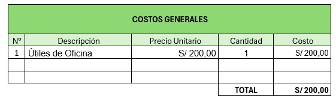

[comment]: 

**UNIVERSIDAD PRIVADA DE TACNA**

**FACULTAD DE INGENIERIA**

**Escuela Profesional de Ingeniería de Sistemas**

**Proyecto: *Predicción De Postulantes Para La Universidad Nacional   De Educación Enrique Guzmán Y Valle***

Curso: *Inteligencia De Negocios*

Docente: *Ing. Cuadros Quiroga, Patrick Jose*

Integrantes:

Melendez Huarachi, Gabriel Fari			(2021070311) 
Lopez Catunta, Brayar Christian         (2020068946)

***{Apellidos y nombres del estudiante (código universitario)}***

**Tacna – Perú**

***2024***

**  
**

\pagebreak

Sistema *{Nombre del Sistema}*

Informe de Factibilidad

Versión *{1.0}*

|CONTROL DE VERSIONES||||||
| :-: | :- | :- | :- | :- | :- |
|Versión|Hecha por|Revisada por|Aprobada por|Fecha|Motivo|
|1\.0|MPV|ELV|ARV|10/10/2020|Versión Original|

\pagebreak

# **INDICE GENERAL**

[1. Descripción del Proyecto](#_Toc52661346)

[2. Riesgos](#_Toc52661347)

[3. Análisis de la Situación actual](#_Toc52661348)

[4. Estudio de Factibilidad](#_Toc52661349)

[4.1 Factibilidad Técnica](#_Toc52661350)

[4.2 Factibilidad económica](#_Toc52661351)

[4.3 Factibilidad Operativa](#_Toc52661352)

[4.4 Factibilidad Legal](#_Toc52661353)

[4.5 Factibilidad Social](#_Toc52661354)

[4.6 Factibilidad Ambiental](#_Toc52661355)

[5. Análisis Financiero](#_Toc52661356)

[6. Conclusiones](#_Toc52661357)

\pagebreak

**<u>Informe de Factibilidad</u>**

1. **Descripción del Proyecto**

    1.1. Nombre del proyecto

    1.2. Duración del proyecto

    1.3. Descripción

        En que consiste el proyecto/importancia del mismo, contexto en que se va desenvolver

    1.4. Objetivos

        1.4.1 Objetivo general
        1.4.2 Objetivos Específicos
            Para cada objetivo específico se indicara que se va a lograr

\pagebreak

2. **Riesgos**

    

    - **Errores en los datos**: La calidad de la información y de los datos históricos utilizados determina en gran medida la precisión de las predicciones. Si los datos son incompletos o inexactos, las predicciones pueden ser erróneas o poco confiables.

    - **Cambios en el entorno académico y factores externos**: Los cambios en la legislación educativa, las políticas de admisión o las circunstancias económicas pueden afectar el número de solicitantes. Estos factores son difíciles de predecir y tienen el potencial de cambiar drásticamente las tendencias observadas en años anteriores.

    - **Resistencia a la Alteración y aceptación de resultados**: El personal académico y administrativo puede oponerse a la implementación de un sistema de predicción. Puede haber errores si no confía en los resultados, lo que podría llevar a una falta de aceptación y aplicación del sistema.

    - **Variabilidad en la conducta de los postulantes y cambios en sus preferencias**: Las preferencias de los candidatos pueden cambiar con el tiempo debido a las tendencias sociales, las nuevas carreras o los programas que ofrecen otras instituciones. Esto puede hacer que las predicciones basadas en datos históricos sean menos pertinentes.

    - **Delimitaciones estratégicas y habilidades analíticas**: La efectividad de los modelos predictivos puede verse afectada por la falta de herramientas adecuadas o de personal capacitado para realizar análisis complejos. Esto puede llevar a una sobreestimación o una subestimación del número de candidatos.

    - **Efecto de la competencia**: La cantidad de postulantes puede verse afectada por la aparición de nuevas universidades o programas académicos en otras instituciones. La competencia es un factor clave que no siempre se puede predecir.

    

\pagebreak

3. **Análisis de la Situación actual**

    3.1. Planteamiento del problema

            Describa antecedentes y situación actual, explicando la problemática y/o necesidad que será resuelta con el proyecto propuesto.

    3.2. Consideraciones de hardware y software

            Hardware y software posibles para la implementación, se analizara lo que existe y es alcanzable, se evaluara que tecnología se puede > utilizar en el proyecto.

\pagebreak

4. **Estudio de
    Factibilidad**

    Describir los resultados que esperan alcanzar del estudio de factibilidad, las actividades que se realizaron para preparar la evaluación de factibilidad y por quien fue aprobado.

    4.1. Factibilidad Técnica

- Tenemos cinco computadoras portátiles con Windows como sistema operativo.
-Contamos con el software necesario para el desarrollo, que incluye Visual Studio Code, XAMMP.
- Disponemos de unas hojas CSV.
- Un equipo de  cinco programadores está trabajando en el proyecto.
- La plataforma será compatible con una amplia gama de dispositivos.
- También hemos incorporado una función de descarga de gráficos y predicciones.
- Se hará uso del  servidor dedicado de la UNE.

     4.2. Factibilidad Económica 

    

      4.2.1. Costos Generales

      Se adquieren 5 equipos a un precio unitario de S/3.000,00, resultando en un costo total de S/15.000,00. Además, se compra 1 útil de oficina por S/150,00. En total, los costos generales ascienden a S/15.150,00.
    

        
    
 

      4.2.2. Costos operativos durante el desarrollo

      El costo mensual del internet es S/120,00, el de la renta de oficina S/1.200,00 y el seguro de robo S/250,00. Se estima que estos costos operen durante 5 meses, lo que genera un costo total de S/7.850,00.
    

        
    
 

      4.2.3. Costos del ambiente

      El costo de hosting de pruebas es de S/180,00, con un precio unitario de S/60,00 por 3 meses. El costo del dominio es de S/20,00, con un precio unitario de S/20,00 por 1 mes. El costo total de los servicios de ambiente es de S/200,00.
    

        
    
 

      4.2.4. Costos de personal

      La tabla muestra los costos de personal para un proyecto, desglosados por puesto. Se listan cinco roles: Jefe de Proyecto, Especialista en IA, Programador, Analista de Datos y Diseñador UX. Para cada rol se indica el precio por hora, la cantidad de horas trabajadas y el costo total. El costo total del personal para el proyecto es de S/30.400,00.
    

        
    
 

      4.2.5. Costos totales del desarrollo del sistema

      Los costos totales se dividen en 4 categorías: costos generales (S/15.150,00), costos operativos (S/7.850,00), costos de ambiente (S/200,00) y costos de personal (S/30.400,00). El total de todos estos costos es S/53.600,00.
    

        
    

    4.3. Factibilidad Operativa

        Describir los beneficios del producto y si se tiene la capacidad por parte del cliente para mantener el sistema funcionando y garantizar el buen funcionamiento y su impacto en los usuarios. Lista de interesados.
  

        
    

    4.4. Factibilidad Legal

      Este proyecto de predicción de postulantes para la Universidad Nacional de Educación Enrique Guzmán y Valle se fundamenta en el cumplimiento de la Ley de Protección de Datos Personales (Ley N° 29733) y su reglamento (Decreto Supremo N° 003-2013-JUS), asegurando que la recolección y manejo de datos de los postulantes se realice de manera ética y legal. Es esencial obtener los permisos necesarios de las autoridades competentes y garantizar la transparencia en el proceso, cumpliendo también con la Ley de Transparencia y Acceso a la Información Pública.

    4.5. Factibilidad Social 

  Un dashboard de Power BI restringido al personal encargado es socialmente factible y beneficioso para la universidad. Esto mejorará la eficiencia, la toma de decisiones y la colaboración interna, mientras protege la confidencialidad de la información.
  
    4.6. Factibilidad Ambiental

  La implementación de un dashboard de Power BI tiene un impacto ambiental reducido y, en muchos aspectos, positivo, como la reducción del uso de papel y la mejora en la eficiencia operativa. Aunque hay un aumento en el consumo de energía y la huella de carbono digital, estos pueden mitigarse mediante el uso de tecnologías y prácticas sostenibles. Adicionar que se usará el servidor de la UNE para aplicar la tecnología. 

\pagebreak

5. **Análisis Financiero**

    El plan financiero se ocupa del análisis de ingresos y gastos asociados a cada proyecto, desde el punto de vista del instante temporal en que se producen. Su misión fundamental es detectar situaciones financieramente inadecuadas.
    Se tiene que estimar financieramente el resultado del proyecto.

    5.1. Justificación de la Inversión

        5.1.1. Beneficios del Proyecto

            El beneficio se calcula como el margen económico menos los costes de oportunidad, que son los márgenes que hubieran podido obtenerse de haber dedicado el capital y el esfuerzo a otras actividades.
            El beneficio, obtenido lícitamente, no es sólo una recompensa a la inversión, al esfuerzo y al riesgo asumidos por el empresario, sino que también es un factor esencial para que las empresas sigan en el  mercado e incorporen nuevas inversiones al tejido industrial y social de las naciones.
            Describir beneficios tangibles e intangibles*
            Beneficios tangibles: son de fácil cuantificación, generalmente están relacionados con la reducción de recursos o talento humano.
            Beneficios intangibles: no son fácilmente cuantificables y están relacionados con elementos o mejora en otros procesos de la organización.
>
            Ejemplo de beneficios:

            - Mejoras en la eficiencia del área bajo estudio.
            - Reducción de personal.
            - Reducción de futuras inversiones y costos.
            - Disponibilidad del recurso humano.
            - Mejoras en planeación, control y uso de recursos.
            - Suministro oportuno de insumos para las operaciones.
            - Cumplimiento de requerimientos gubernamentales.
            - Toma acertada de decisiones.
            - Disponibilidad de información apropiada.
            - Aumento en la confiabilidad de la información.
            - Mejor servicio al cliente externo e interno
            - Logro de ventajas competitivas.
            - Valor agregado a un producto de la compañía.
        
        5.1.2. Criterios de Inversión

            5.1.2.1. Relación Beneficio/Costo (B/C)

                En base a los costos y beneficios identificados se evalúa si es factible el desarrollo del proyecto. 
                Si se presentan varias alternativas de solución se evaluará cada una de ellas para determinar la mejor solución desde el punto de vista del > retorno de la inversión
                El B/C si es mayor a uno, se acepta el proyecto; si el B/C es igual a uno es indiferente aceptar o rechazar el proyecto y si el B/C es menor a uno se rechaza el proyecto

            5.1.2.2. Valor Actual Neto (VAN)
            
                Valor actual de los beneficios netos que genera el proyecto. Si el VAN es mayor que cero, se acepta el proyecto; si el VAN es igual a cero es indiferente aceptar o rechazar el proyecto y si el VAN es menor que cero se rechaza el proyecto

            5.1.2.3 Tasa Interna de Retorno (TIR)*
                Es la tasa porcentual que indica la rentabilidad promedio anual que genera el capital invertido en el proyecto. Si la TIR es mayor que el costo de oportunidad se acepta el proyecto, si la TIR es igual al costo de oportunidad es indiferente aceptar o rechazar el proyecto, si la TIR es menor que el costo de oportunidad se rechaza el proyecto

                Costo de oportunidad de capital (COK) es la tasa de interés que podría haber obtenido con el dinero invertido en el proyecto

\pagebreak

6. **Conclusiones**

Factibilidad Social Alta: Si se implementa correctamente, con las medidas de seguridad adecuadas y una formación apropiada para el personal, la integración de un dashboard de Power BI restringido al personal encargado es socialmente factible y beneficioso para la universidad. Esto mejorará la eficiencia, la toma de decisiones y la colaboración interna, mientras protege la confidencialidad de la información.

Factibilidad Ambiental Alta: La implementación de un dashboard de Power BI tiene un impacto ambiental reducido y, en muchos aspectos, positivo, como la reducción del uso de papel y la mejora en la eficiencia operativa. Aunque hay un aumento en el consumo de energía y la huella de carbono digital, estos pueden mitigarse mediante el uso de tecnologías y prácticas sostenibles.

El proyecto tiene una alta factibilidad técnica. El éxito dependerá de la coordinación eficaz del equipo de desarrollo, la gestión de los recursos de hardware, y la implementación cuidadosa de las funcionalidades requeridas.
