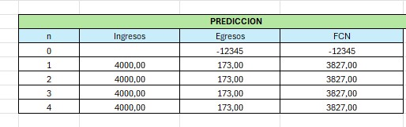
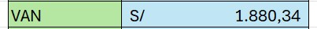
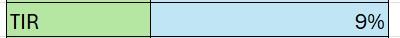

[comment]: 

**UNIVERSIDAD PRIVADA DE TACNA**

**FACULTAD DE INGENIERIA**

**Escuela Profesional de Ingeniería de Sistemas**

**Proyecto: *Dashboard de Deteccion Temprana de Abandono Estudiantil para el area de tutoria EPIS UPT***

Curso: *Inteligencia De Negocios*

Docente: *Ing. Cuadros Quiroga, Patrick Jose*

Integrantes:

Melendez Huarachi, Gabriel Fari			(2021070311) 
Lopez Catunta, Brayar Christian         (2020068946) 
Briceño Diaz, Jorge Luis               (2017059611) 
Cuadros Garcia, Mirian				(2021071083) 
Hurtado Ortiz, Leandro				(2015052384) 
Chino Rivera, Angel Alessandro		(2021069830) 

**Tacna – Perú**

***2024***

**  
**

\pagebreak

Sistema *{Nombre del Sistema}*

Informe de Factibilidad

Versión *{1.0}*

|CONTROL DE VERSIONES||||||
| :-: | :- | :- | :- | :- | :- |
|Versión|Hecha por|Revisada por|Aprobada por|Fecha|Motivo|
|1\.0|MCG|BLC|LHO|31/08/2024|Versión Original|

\pagebreak

# **INDICE GENERAL**

[1. Descripción del Proyecto](#_Toc52661346)

[2. Riesgos](#_Toc52661347)

[3. Análisis de la Situación actual](#_Toc52661348)

[4. Estudio de Factibilidad](#_Toc52661349)

[4.1 Factibilidad Técnica](#_Toc52661350)

[4.2 Factibilidad económica](#_Toc52661351)

[4.3 Factibilidad Operativa](#_Toc52661352)

[4.4 Factibilidad Legal](#_Toc52661353)

[4.5 Factibilidad Social](#_Toc52661354)

[4.6 Factibilidad Ambiental](#_Toc52661355)

[5. Análisis Financiero](#_Toc52661356)

[6. Conclusiones](#_Toc52661357)

\pagebreak

**<u>Informe de Factibilidad</u>**

1. **Descripción del Proyecto**

    1.1. Nombre del proyecto  
    
   Dashboard de Detección Temprana de Abandono Estudiantil para el área de tutoría de EPIS UPT

    1.2. Duración del proyecto 
    
   Un tiempo de 3 meses.
   
    1.3. Descripción

    

    El "Dashboard de Detección Temprana de Abandono Estudiantil" tiene como objetivo principal apoyar el área de tutoría de la Escuela Profesional de Ingeniería de Sistemas (EPIS) de la Universidad Privada de Tacna (UPT). Utiliza datos académicos como notas, inasistencias, género, edad y cursos para generar visualizaciones que permitan identificar patrones y factores de riesgo relacionados con el abandono estudiantil. Con la ayuda de este sistema, se busca detectar de manera proactiva a estudiantes con alta probabilidad de deserción, permitiendo que los tutores y docentes implementen estrategias de intervención a tiempo.
    

    1.4. Objetivos

   1.4.1 Objetivo general
    

    			Implementar un dashboard interactivo que permita detectar de manera temprana el riesgo de abandono estudiantil en los alumnos de EPIS UPT, mediante el análisis de datos académicos, para mejorar las estrategias de tutoría y asegurar la permanencia de los estudiantes en sus estudios.
    

    1.4.2 Objetivos Específicos
    

        
     - **Identificar patrones de inasistencia y rendimiento académico** que puedan estar asociados con un alto riesgo de abandono.
     
     - **Proporcionar visualizaciones dinámicas y fáciles de interpretar** para que los tutores y docentes puedan tomar decisiones informadas sobre la intervención temprana con los estudiantes en riesgo.
    
     - **Analizar la relación entre variables sociodemográficas** como el género , la edad , curso , ciclo  , el rendimiento académico y la asistencia.
    
    - **Optimizar las estrategias de tutoría** mediante el uso de datos históricos que permitan detectar tendencias de deserción y proponer mejoras a nivel institucional.
    

3. **Riesgos**

    

    - **Riesgo de Privacidad de Datos**: La recopilación de información sensible, como notas y asistencia, puede generar preocupaciones sobre la privacidad.

    - **Riesgo de Uso Inadecuado de la Información**: La correcta interpretación de los datos es vital. Si los tutores malinterpretan las visualizaciones, podrían tomar decisiones erróneas que afecten a los estudiantes en riesgo, socavando la efectividad del dashboard.

    - **Riesgo de Dependencia de la Tecnología**: El funcionamiento del dashboard es esencial para su efectividad. Si el sistema falla o no se actualiza, puede dejar de ser útil, impidiendo intervenciones a tiempo para prevenir el abandono escolar.

    - **Riesgo de Capacitación del Personal**: La eficacia del dashboard depende de la capacitación adecuada de docentes. Sin la formación necesaria, la herramienta puede no utilizarse plenamente, limitando su impacto en la detección temprana.

    - **Riesgo de Resistencia al Cambio**: La adopción de nuevas tecnologías puede enfrentar resistencia por parte del personal académico. Superar esta resistencia es clave para asegurar la aceptación del dashboard y su efectividad.

    - **Riesgo de Sustitución de la Relación Humana**: Aunque el dashboard ofrece datos valiosos, existe el riesgo de que se priorice el análisis sobre la conexión humana. La relación personal entre tutores y estudiantes es esencial para el apoyo emocional y la motivación.

    

3. **Análisis de la Situación actual**

    3.1. Planteamiento del problema

   

    			En la Escuela Profesional de Ingeniería de Sistemas (EPIS) de la Universidad Privada de Tacna (UPT), el abandono estudiantil representa un desafío importante que afecta tanto el rendimiento académico general como el bienestar de los estudiantes. A lo largo de los últimos años, se ha observado un incremento en la tasa de deserción, lo que genera preocupación tanto en las autoridades académicas como en los tutores responsables de guiar y apoyar a los alumnos. El abandono de los estudios no solo repercute en la trayectoria educativa de los estudiantes, sino también en la reputación y eficiencia de la institución.

Entre las principales causas que contribuyen a este fenómeno se encuentran las inasistencias reiteradas, el bajo rendimiento académico, problemas personales y la falta de un seguimiento adecuado por parte del área de tutoría. Sin embargo, la falta de herramientas eficientes para detectar a tiempo estos factores de riesgo limita la capacidad de los tutores para intervenir de manera proactiva.
    

    
3.2. Consideraciones de hardware y software

    La implementación del "Dashboard de Detección Temprana de Abandono Estudiantil" en la Escuela Profesional de Ingeniería de Sistemas (EPIS) de la Universidad Privada de Tacna (UPT) debe tener en cuenta las capacidades de las workstations disponibles en el laboratorio de sistemas y las herramientas tecnológicas disponibles en la universidad.	

    **Hardware:**
    Las estaciones de trabajo de la EPIS en UPT cuentan con las siguientes especificaciones:
    Procesador: Intel Core i7 .
    Memoria RAM: 8GB a 16GB.
    Disco Duro: SSD de 256GB o HDD de 500GB a 1TB.
    Tarjeta Gráfica: GPU integrada (Intel HD Graphics) o discreta (NVIDIA GeForce).
    Monitores: Pantallas de 21" o más, resolución Full HD.
    Conectividad: Conexión a red LAN y Wi-Fi con velocidad adecuada para procesamiento de datos y transmisión de información.

Herramientas de Análisis y Visualización de Datos:
    Tableau: Software que puede ser utilizado para la creación y despliegue de dashboards interactivos. Alternativamente, podrían usarse soluciones open-source como Metabase.

\pagebreak

4. **Estudio de
    Factibilidad**

    Describir los resultados que esperan alcanzar del estudio de factibilidad, las actividades que se realizaron para preparar la evaluación de factibilidad y por quien fue aprobado.

    4.1. Factibilidad Técnica

- Contamos con el software necesario para el desarrollo, que incluye Tableau.
- Disponemos de unas hojas excel con informacion de los estudiantes.
- Un equipo de  2 programadores está trabajando en el proyecto. Asi como un programador AI, un analista de datos y un jefe de proyecto.
- La plataforma será compatible con una amplia gama de dispositivos.
- También hemos incorporado una función de descarga de gráficos.
- Se hará uso del  servidor dedicado de la UPT.

     4.2. Factibilidad Económica 

    

      4.2.1. Costos Generales

               Para el reporte semanal, indicamos que los costos generales incluyen la compra de útiles de oficina La compra de
               útiles de oficina, en el precio unitario de estos artículos con un valor de S/ 200,00
    

        
    
 

      4.2.2. Costos operativos durante el desarrollo

               La primera es el alquiler de equipo, con 2 unidades a un costo mensual de S/ 300.00 por un mes, resultando en un costo total
               de S/ 600.00. La segunda partida es para la línea móvil, con 3 unidades a un costo mensual de S/ 75.00 por un mes, totalizando
               S/ 225.00. El costo operativo total es de S/ 825.00.
    

        
    
 

      4.2.3. Costos del ambiente

               El hosting de pruebas por un mes, con un precio unitario de S/ 120.00. El costo total para este servicio es de S/ 120.00.
    

        
    
 

      4.2.4. Costos de personal

                El cuadro presenta los costos de personal para tres roles en un proyecto: un Jefe de Proyecto, un Programador de Machine Learning,
                y un Analista de Datos. El Jefe de Proyecto tiene una tarifa de S/ 25,00 por hora y trabaja 160 horas, resultando en un costo de
                S/ 4.000,00. Tanto el Programador de Machine Learning como el Analista de Datos tienen una tarifa de S/ 20,00 por hora y trabajan
                180 horas cada uno, generando un costo de S/ 3.600,00 para cada uno. El costo total del personal es S/ 11.200,00.
    

        
    
 

      4.2.5. Costos totales del desarrollo del sistema

                 Se presenta un desglose de varios conceptos de gastos. Los Costos Generales ascienden a S/ 200,00, los Costos Operativos son
                 de S/ 825,00, los Costos de Ambiente suman S/ 120,00, y los Costos de Personal representan el mayor gasto con S/ 11.200,00.
                 En conjunto, el total de estos costos alcanza la suma de S/ 12.345,00.
    

        
    

    4.3. Factibilidad Operativa

       Factibilidad operativa en la imagen detalla los costos iniciales y de mantenimiento para un proyecto, incluyendo roles clave como el Jefe de Proyecto, Programador IA y Analista de datos, además de recursos como el hosting, alquiler de equipo y línea móvil. El costo inicial total asciende a 9485, con un mantenimiento anual de 14020, lo que da un costo total de 23505. El tiempo estimado para la fase inicial es de 180 horas.
  

        
    

    4.4. Factibilidad Legal

      Este proyecto de "Dashboard de Detección Temprana de Abandono Estudiantil" se basa en el cumplimiento de la Ley de
      Protección de Datos Personales (Ley N° 29733) y su reglamento (Decreto Supremo N° 003-2013-JUS). Es esencial obtener
      el consentimiento informado de los estudiantes, explicando claramente el uso de sus datos y su propósito, lo que
      ayuda a mantener la confianza en el sistema.

    4.5. Factibilidad Social 

  Un dashboard de Tableau restringido al personal encargado es socialmente factible y beneficioso para la universidad. Esto mejorará la eficiencia, la toma de decisiones y la colaboración interna, mientras protege la confidencialidad de la información.
  
    4.6. Factibilidad Ambiental

  La implementación de un dashboard de Tableau tiene un impacto ambiental reducido y, en muchos aspectos, positivo, como la reducción del uso de papel y la mejora en la eficiencia operativa. Aunque hay un aumento en el consumo de energía y la huella de carbono digital, estos pueden mitigarse mediante el uso de tecnologías y prácticas sostenibles. Además, se aprovechará la infraestructura de TI existente en la universidad y el servidor de la UPT, lo que reducirá costos adicionales en hardware y permitirá una implementación eficiente de la tecnología.

\pagebreak

5. **Análisis Financiero**

    5.1. Justificación de la Inversión

   La inversión está justificada por su alta rentabilidad financiera, la optimización de los recursos, la reducción de costos, y la mejora en la toma de decisiones estratégicas. Todo ello contribuye a una gestión más eficiente de la admisión, incrementa los ingresos y fortalece la posición competitiva de la universidad, garantizando un retorno favorable sobre la inversión realizada.

        5.1.1. Beneficios del Proyecto
   
               ● Beneficios Tangibles:
                  - Reducción de egresos a S/ 173, lo que optimiza los costos operativos
                  - Valor Actual Neto (VAN) positivo de S/ 1,880.34, confirmando la rentabilidad del proyecto.
                  - Mejor uso de recursos financieros y humanos, maximizando la eficiencia general.
                  - Mejora en la eficiencia de admisiones.
                  - Se prevé un ingreso anual de S/ 4,000, lo que asegura la sostenibilidad financiera.
                  - Generación de un Flujo de Caja Neto (FCN) positivo de S/ 3,827, garantizando liquidez.

               ● Beneficios Intangibles:
                  - Mejora en la toma de decisiones estratégicas mediante análisis de datos precisos.
                  - Incremento en la retención de estudiantes al detectar riesgos de abandono tempranamente.
                  - Fortalecimiento de la imagen institucional, aumentando la confianza en la EPIS UPT.
                  - Mayor efectividad en las intervenciones de tutoría, brindando apoyo oportuno a los estudiantes en riesgo.
                  - Adaptabilidad y resiliencia ante cambios.
                  - Fomento de una cultura proactiva en la prevención del abandono escolar.

 
        
        5.1.2. Criterios de Inversión
                Se proyectan ingresos anuales de S/ 4,000 durante cuatro meses, sumando un total de S/ 16,000.
                Los egresos anuales son de S/ 173, alcanzando un total de S/ 692 en el mismo período.
                
                - Flujo de Caja Neto (FCN) y Valor Actual:
                El Flujo de Caja Neto (FCN) se calcula restando los egresos de los ingresos, obteniendo S/ 15,308.
                El Valor Actual Neto (VAN), descontando los flujos de caja a lo largo del tiempo, llega a S/ 7,520.34, lo que indica la rentabilidad del proyecto.               
 
    

        
    
 

            5.1.2.1. Relación Beneficio/Costo (B/C)
                       La relación B/C mide cuánto beneficio se obtiene por cada sol invertido en el proyecto. En base a la tabla, el B/C es 1.15, lo que indica 
                       que el proyecto es rentable y cada sol invertido genera S/ 1.15 en ingresos.
 
    

        
    
 
    
            5.1.2.2. Valor Actual Neto (VAN)
                       El VAN es una medida que indica cuánto valor genera un proyecto en términos presentes, considerando los flujos de caja futuros descontados a 
                       una tasa determinada. En base a la tabla, el VAN es S/ 1,880.34, lo que indica que el proyecto es rentable, ya que generará un valor adicional 
                       por encima de lo invertido. Un VAN positivo significa que el proyecto no solo recuperará la inversión inicial, sino que también generará una 
                       ganancia neta a lo largo del tiempo.
 
    

        
    
 

            5.1.2.3 Tasa Interna de Retorno (TIR)*
                       La TIR es la tasa de descuento a la cual el VAN es igual a cero. Es decir, mide el rendimiento esperado del proyecto. En base a la tabla, la TIR 
                       es 9%, lo que significa que el proyecto tiene una tasa de retorno positiva. Esto implica que, si el costo de capital o tasa de descuento es menor 
                       al 9%, el proyecto será rentable. Cuanto mayor sea la TIR en relación con el costo de capital, mayor será la ganancia generada por la inversión.
 
    

        
    
 

6. **Conclusiones**

- **Cumplimiento Legal y Ético:**
  - Es crucial adherirse a las leyes y regulaciones vigentes en cualquier proyecto que involucre la recolección y análisis de datos, como el riesgo de abandono estudiantil.
  - Esto no solo protege los derechos de los individuos, sino que también asegura que la institución actúe de manera ética y responsable, evitando posibles sanciones y problemas legales.

- **Transparencia y Capacitación:**
  - La transparencia en la gestión de datos y la capacitación del personal son elementos clave para construir una relación de confianza con los estudiantes.
  - Una comunicación adecuada sobre cómo se manejarán los datos y el compromiso con la protección de la información puede resultar en una mayor aceptación y participación en el proceso de inscripción.

- **Factibilidad Social Alta:**
  - Si se implementa correctamente, con las medidas de seguridad adecuadas y una formación apropiada para el personal, la integración de un dashboard de Tableau restringido al personal encargado es socialmente factible y beneficioso para la universidad.
  - Esto mejorará la eficiencia, la toma de decisiones y la colaboración interna, mientras protege la confidencialidad de la información.

- **Factibilidad Ambiental Alta:**
  - La implementación de un dashboard de Tableau tiene un impacto ambiental reducido y, en muchos aspectos, positivo, como la reducción del uso de papel y la mejora en la eficiencia operativa.
  - Aunque hay un aumento en el consumo de energía y la huella de carbono digital, estos pueden mitigarse mediante el uso de tecnologías y prácticas sostenibles.

- **Factibilidad Técnica Alta:**
  - El proyecto tiene una alta factibilidad técnica.
  - El éxito dependerá de la coordinación eficaz del equipo de desarrollo, la gestión de los recursos de hardware, y la implementación cuidadosa de las funcionalidades requeridas.
